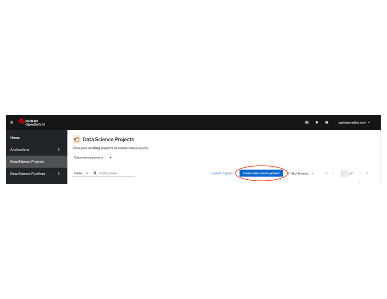
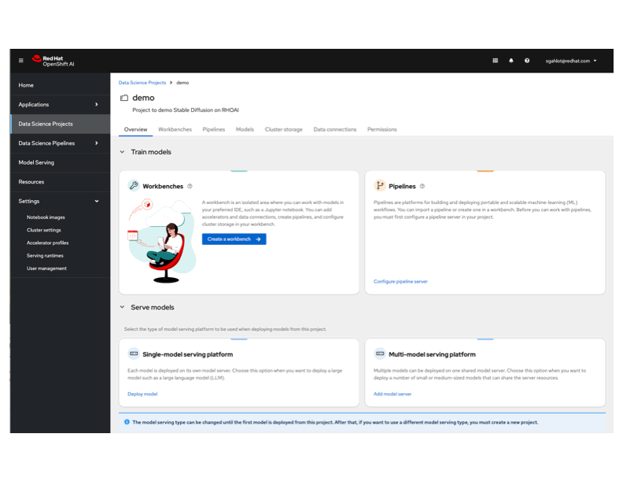
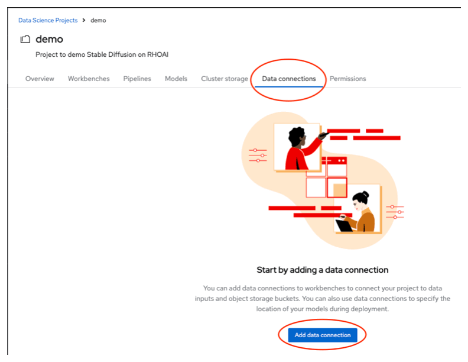
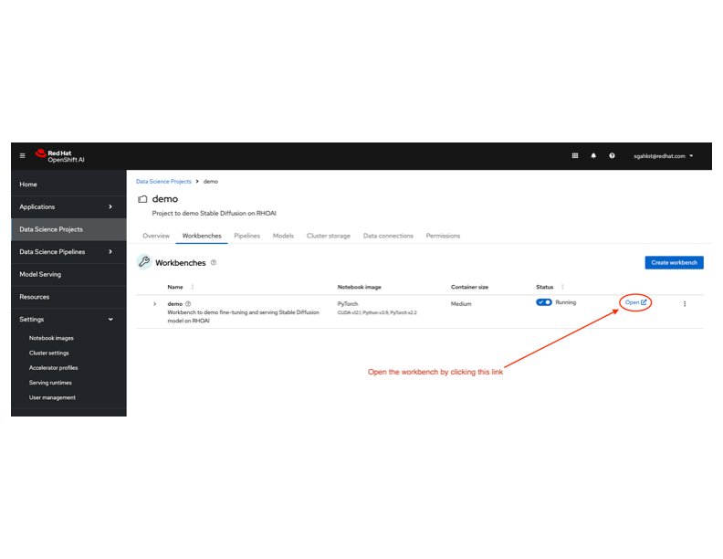

# POC for Jupyter Notebook and Label Studio integration

This readme shows how to use the notebook to set up Label Studio project, import the labelling tasks from the dataset stored in an AWS S3 bucket into the project for labelling, and export the labelled tasks from the Label Studio project to fine-tune an Name Entity Recognition (NER) pretrained model. This use case demonstrates how the user can use Label Studio to review and correct the labels in the training dataset in order to improve the training performance.

## Prerequisites

Before you can fine-tune and serve a model in Red Hat OpenShift AI, you will need to install RHOAI and enable NVIDIA GPU by following these links:
* [Red Hat OpenShift AI installation](https://docs.redhat.com/en/documentation/red_hat_openshift_ai_self-managed/2.13/html-single/installing_and_uninstalling_openshift_ai_self-managed/index#installing-and-deploying-openshift-ai_install)
* [Enable NVIDIA GPU](https://docs.redhat.com/en/documentation/red_hat_openshift_ai_self-managed/2.13/html/installing_and_uninstalling_openshift_ai_self-managed/enabling-nvidia-gpus_install#enabling-nvidia-gpus_install)

This POC uses `AWS S3` to store the training data before it gets updated by the user through Label Studio, and the training data after the has reviewed and updated the training data. The training data is stored as the standard Label Studio json format.  Make sure you have have setup the IAM user, credentials and permissions to download from files from the bucket or upload files to the bucket.

## Quickstart

### Deploy Label Studio on OpenShift Cluster

```
oc new-project labelstudio-poc
oc -f labelstudio.yaml -n labelstudio-poc
```

Find the URL for the Label Studio UI:
```
oc get route labelstudio -o jsonpath='{"http://"}{.spec.host}{"\n"}'
```

Open a web browser and use this URL to open the Label Studio UI. Create a user account if this is the first time you open the UI.

After login, you can click the user icon and go to `Account and Settings` to generate an acccess token which will be used later for the Jupyter Notebook to access Label Studio via API calls.

### Create Data Science project
Open up `Red Hat OpenShift AI` by selecting it from OpenShift Application Launcher. This will open up Red Hat OpenShift AI in a new tab.
Select Data Science Projects in the left navigation menu.

Create a new Data Science project by clicking on `Create data science project` button.
Provide the `Name` as well as the `Resource name` for the project, and click on `Create` button. This will create a new data science project for you.

Select your newly created project by clicking on it.

Below is a gif showing `Create data science project` dialogs:


#### Setup AWS S3
To setup AWS S3, for storing the LoRA weights, setup the following:
* Create IAM user
* Add following permissions to the user, with the `Effect: "Allow"`:
  * `s3:ListBucket`
  * `s3:*Object`
  * `s3:ListAllMyBuckets`
  * `s3:CreateBucket`
    * **This permission is ONLY needed if you want bucket to be created by the notebook**
* For the above permissions, set `Resource` to:
  * `arn:aws:s3:::*`
  * _If an already existing bucket is used, then the `Resource` can be set to the specific bucket, e.g._
    * `arn:aws:s3:::<EXISTING_BUCKET_NAME>`


### Create workbench
To use RHOAI for this project, you need to create a workbench first. In the newly created data science project, create a new Workbench by clicking `Create workbench` button in the `Workbenches` tab.

When creating the workbench, add the following environment variables:
* AWS_ACCESS_KEY_ID
* AWS_SECRET_ACCESS_KEY
* AWS_S3_ENDPOINT
  * In the format of `https://s3.<REGION>.amazonaws.com`
* AWS_S3_BUCKET
  * Existing S3 bucket
* AWS_DEFAULT_REGION
* LABEL_STUDIO_URL
  * URL to access Label Studio UI. 
* API_KEY
  * The API key to access Label Studio UI.

  _The environment variables can be added one by one, or all together by uploading a secret yaml file_

Use the following values for other fields:
* _Notebook image_:
  * Image selection: **PyTorch**
  * Version selection: **2024.1**
* _Deployment size_:
  * Container size: **Medium**
  * Accelerator: **NVIDIA GPU**
  * Number of accelerators: **1**
* _Cluster storage_: **50GB**

Create the workbench with above settings.

Below is a gif showing various sections of `Create Workbench`:



### Create Data connection
Create a new data connection that can be used by the init-container (`storage-initializer`) to fetch the LoRA weights generated in next step when deploying the model.

To create a Data connection, use the following steps:
* Click on `Add data connection` button in the  `Data connections` tab in your newly created project
* Use the following values for this data connection:
  * _Name_: `minio`
  * _Access key_: value specified for `AWS_ACCESS_KEY_ID` field in `Create Workbench` section
  * _Secret key_: value specified for `AWS_SECRET_ACCESS_KEY` field in `Create Workbench` section
  * _Endpoint_: value specified for `AWS_S3_ENDPOINT` field in `Create Workbench` section
  * _Access key_: value specified for `AWS_DEFAULT_REGION` field in `Create Workbench` section
  * _Bucket_: value specified for `AWS_S3_BUCKET` field in `Create Workbench` section
* Create the data connection by clicking on `Add data connection` button

Below is a gif showing the `Add data connection` dialog (_the values shown are for MinIO_):



### Open workbench
Open the newly created workbench by following these steps:
* Select your newly created project by clicking on `Data Science Projects` in the sidebar menu
* Click on `Workbenches` tab and open the newly created workbench by clicking on the `Open` link
* The workbench will open up in a new tab
* _When the workbench is opened for the first time, you will be shown an `Authorize Access` page._
  * _Click `Allow selected permissions` button in this page._

Below is a gif showing `Open workbench` pages:



### Clone repo
Now that the workbench is created and running, follow these steps to setup the project:
* In the workbench, click on `Terminal` icon in the `Launcher` tab.
* Clone this repository in the `Terminal` by running the following command:
  `git clone git@github.com:jianrongzhang89/label-studio-ml-backend.git`


### Run Jupyter notebook

You can load the input training data into Label Studio UI directly for labelling, or storing it in the Amazon S3 bucket and having the notebook to download the file and import into the Label Studio project.

* Once the repository is cloned, select the folder where you cloned the repository (in the sidebar) and navigate to `abel_studio_ml/examples/huggingface_ner` directory and open up [notebook_labelstudio.ipynb](./notebook_labelstudio.ipynb).
* Before you run the notebook, check and update the values of these variables:
  * `import_test_data_from_aws` = `True` # Set to True to import data stored in S3 bucket to the Label Studio project
  * `existing_project_id` = `0` # If 0, a new project will be created. Otherwise set to the existing Label Studio project ID
  * `project_title` = 'Huggingface Project' # Title of the Label Studio project. Ignored if existing_project_id > 0.
  * `input_file_dir` = "ner-source"  # Directory where the input data file is stored in AWS S3 bucket
  * `input_file`='traningdata-1000-before.json'
* Run this notebook by selecting `Run` -> `Run All Cells` menu item
* _When the notebook successfully runs, your fine-tuned model should have been uploaded to AWS or MinIO in the bucket specified for `AWS_S3_BUCKET` in `Create Workbench` section_.

Note: you can import the training data into Label Studio UI directly for review and labelling. In this case, set `import_test_data_from_aws = False` and `existing_project_id` to the corresponding Label Studio Project ID which can be found in the project URL displayed in the UI.

Configuration for the Label Studio project for the NER model:
```xml
<View>
  <Labels name="label" toName="text">
    <Label value="PER" background="red"/>
    <Label value="ORG" background="darkorange"/>
    <Label value="LOC" background="orange"/>
    <Label value="MISC" background="green"/>
  </Labels>

  <Text name="text" value="$text"/>
</View>
```

### Check model training performance

The notebook displays model training result with the metrics. About 1000 entries in the traing dataset were used. The dataset was generated as follows:
1) Take a subset of the published training dataset with 1000 entries.
2) Use the pretrained dslim/bert-base-NER to generate predictions for the texts for this subset. This becomes a base dataset for this POC.

The base dataset is imported to Label Studio for review and labelling. After the Label Studio user has completed the labelling work, run the notebook again with `import_test_data_from_aws=false` and `existing_project_id` set to the ID of the corresonding Label Studio project. User can use Label Studio UI to export the updated dataset. 

See the sample notebook outputs below:
* [notebook_labelstudio-01](./notebook-output/notebook_labelstudio_with_output_before.ipynb)
* [notebook_labelstudio-02](./notebook-output/notebook_labelstudio_with_output_after.ipynb)

## Links
* [Label Studio Documentation](https://labelstud.io/guide/quick_start)
* [Red Hat OpenShift AI installation](https://docs.redhat.com/en/documentation/red_hat_openshift_ai_self-managed/2.13/html-single/installing_and_uninstalling_openshift_ai_self-managed/index#installing-and-deploying-openshift-ai_install)
* [About Model serving](https://docs.redhat.com/en/documentation/red_hat_openshift_ai_self-managed/2-latest/html/serving_models/about-model-serving_about-model-serving)
* [Enable NVIDIA GPU](https://docs.redhat.com/en/documentation/red_hat_openshift_ai_self-managed/2.13/html/installing_and_uninstalling_openshift_ai_self-managed/enabling-nvidia-gpus_install#enabling-nvidia-gpus_install)
